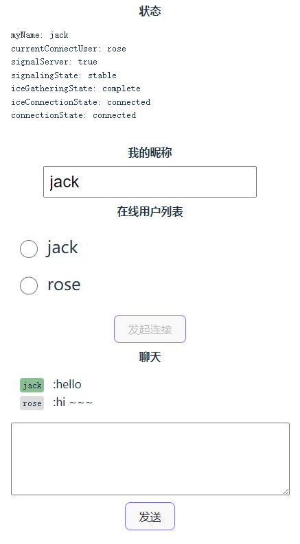

# webrtc-demo

通过webrtc  datachannel进行聊天的示例

Demo: http://webrtc.veikr.com



## 项目结构

- `client`: 使用svelte写的网页客户端
- `server`: WebSocketServer，用于帮助客户端发现在线用户，进行WebRTC信令交换


## 编译和运行

直接运行`build.bat`进行编译，需要pnpm

client/server分别编译，然后复制到根目录的dist目录下。
在此目录运行 `node main.mjs` 即可运行，访问 `http://localhost`

## 使用docker

```sh
docker run -itd --name webrtc -p 80:80 registry.cn-hongkong.aliyuncs.com/tonyzzp/webrtc
```
